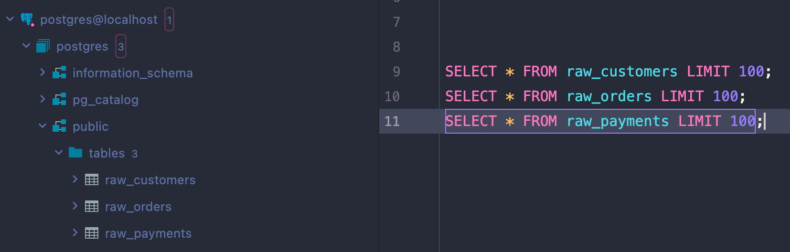

# About this project

The flows in this directory demonstrate data ingestion to Postgres and BigQuery. 

# Setup

Once you have a virtual environment ready (not needed if you leverage GitHub Codespaces), install the dataplatform module (and all dependent libraries including Prefect) from the root project directory using the following command:

```bash
pip install -e .
pip install -r requirements-zoomcamp.txt
```

## Authenticate with Cloud

To authenticate with Cloud, create an API key in your Prefect Cloud workspace. Then, run this command from a terminal:

```bash
prefect cloud login
```

Paste your API key, then select your workspace and give a name to the CLI profile - I named mine `dev`. 


## Postgres setup
Then, start a container running postgres using the command:

```bash
docker run --restart always --name postgres14 --network host -v postgres_data:/var/lib/postgresql/data -p 5432:5432 -d -e POSTGRES_PASSWORD=postgres postgres:14
```

> Alternatively, you can connect to a postgres database in other way (e.g. using your existing DB). In that case, make sure to adjust the credentials on the Postgres block [create_blocks.py](create_blocks.py).


## Optional: AWS CLI setup

The default setup is downloading data directly from https://www.nyc.gov/site/tlc/about/tlc-trip-record-data.page. If you want to, you could get a more realistic setup by reading this data from AWS S3. The same Taxi dataset is [maintained by AWS](https://registry.opendata.aws/nyc-tlc-trip-records-pds/) in the OpenData registry.

If you haven't already, sign up for a free account on AWS and create an IAM user with programmatic access to S3. 

Then, download AWS CLI using:

```bash
curl "https://awscli.amazonaws.com/awscli-exe-linux-x86_64.zip" -o "awscliv2.zip"
unzip awscliv2.zip
sudo ./aws/install
```

Then, run:
```bash
aws configure
```

Enter your IAM user credentials. Your AWS CLI setup is complete. 

Now you can replace the `extract` step with the `extract_from_s3`.

Also replace `get_files_to_process` with `get_files_to_process_aws` in your both `taxi_data` flows:
- [ingestion_postgres_taxi_data.py](ingestion_postgres_taxi_data.py)
- [ingestion_bigquery_taxi_data.py](ingestion_bigquery_taxi_data.py)


# Create blocks

## GCP credentials

Create a `GcpCredentials` block - the easiest way to do it is from the UI. Make sure to paste your service account information from your JSON file into the `service_account_info` block's field.


## Custom blocks

Once your GCP credentials are configured, you are ready to create custom database-specific blocks. You can do that by running the following command from the same directory as this file [create_blocks.py](create_blocks.py):

```bash
python create_blocks.py 
```

---

# Running ingestion flows

## Postgres

You can start with the jaffle-shop example ingesting data to Postgres in the flow [ingestion_postgres.py](ingestion_postgres.py).

Once you run this flow, your Postgres should show those three new tables. You can query and inspect those from your favorite SQL client (*here, I'm using Datagrip*):



You can also inspect the flow run from the Prefect UI:


If you run your setup from GitHub codespaces, you can use the CLI to query the data:
```bash
docker exec -it postgres14 psql -U postgres postgres 

select file, count(*) as nr_rows from yellow_tripdata group by file order by file;
SELECT * FROM yellow_tripdata LIMIT 5;
SELECT * FROM raw_customers LIMIT 5;
SELECT * FROM raw_orders LIMIT 5;
SELECT * FROM raw_payments LIMIT 5;
```


## BigQuery

To ingest the same jaffle-shop example data to BigQuery, run the flow [ingestion_bigquery.py](ingestion_bigquery.py). This flow is functionally equivalent, except that it uses a different block (a dedicated block for `BigQuery`) and it creates a BigQuery dataset if the one you specified doesn't exist yet:

```python
from dataplatform.blocks import BigQueryPandas
...
block = BigQueryPandas.load("default")
block.create_dataset_if_not_exists(dataset)
block.load_data(dataframe=df, table_name=tbl, if_exists="replace")
```


---
# Taxi dataset

Given that the Zoomcamp is based on the taxi dataset, we can apply the existing code to this new dataset. We'll make some slight modifications to the flow logic to ensure that when processing multiple files, we don't accidentally upload some of them twice, resulting in duplicates in the data. 

> In real life, you can treat such tables as temporary staging tables that get truncated before new values get ingested. Then, use either dbt or your own query with MERGE logic in downstream flows to ensure that only new rows get inserted (without duplicates) and modified ones get updated. 

## Postgres

To ingest that taxi data to Postgres, run the flow [ingestion_postgres_taxi_data.py](ingestion_postgres_taxi_data.py). You may notice that in this script we are cheating:

```python
load_to_postgres.with_options(name=f"load_{file}").submit(df.result().head(100), table, if_exists)
```

Taxi dataset is large, and Postgres is an OLTP database (made for transactions, not analytical queries on large datasets). We are using `df.head(100)` to only ingest the first 100 rows of each file. This way, the process is running quickly and you can still explore how everything works. 

After you ran the flow, your Prefect UI should show a similar flow run:


It includes a long list of extract, transform and load task for each file. 

You can continue exploring the data in SQL:


## BigQuery

Let's now run the final flow ingesting the entire dataset for yellow taxi data into BigQuery. This will ingest all files for a given service (yellow or green) and year. 

Once the flow finishes, you'll be able to view the following information on the JSON block named "yellow":

```json
{
  "yellow_tripdata_2022-01.parquet": {
    "nrows": 2463931,
    "table": "trips_data_all.yellow_tripdata",
    "ingested_at": "2022-11-15T14:00:59.351976"
  },
  "yellow_tripdata_2022-02.parquet": {
    "nrows": 2979431,
    "table": "trips_data_all.yellow_tripdata",
    "ingested_at": "2022-11-15T14:02:30.210328"
  },
  "yellow_tripdata_2022-03.parquet": {
    "nrows": 3627882,
    "table": "trips_data_all.yellow_tripdata",
    "ingested_at": "2022-11-15T14:03:44.319097"
  },
  "yellow_tripdata_2022-04.parquet": {
    "nrows": 3599920,
    "table": "trips_data_all.yellow_tripdata",
    "ingested_at": "2022-11-15T14:04:35.656972"
  },
  "yellow_tripdata_2022-05.parquet": {
    "nrows": 3588295,
    "table": "trips_data_all.yellow_tripdata",
    "ingested_at": "2022-11-15T14:05:52.936527"
  },
  "yellow_tripdata_2022-06.parquet": {
    "nrows": 3558124,
    "table": "trips_data_all.yellow_tripdata",
    "ingested_at": "2022-11-15T14:06:50.370819"
  },
  "yellow_tripdata_2022-07.parquet": {
    "nrows": 3174394,
    "table": "trips_data_all.yellow_tripdata",
    "ingested_at": "2022-11-15T14:07:37.442421"
  },
  "yellow_tripdata_2022-08.parquet": {
    "nrows": 3152677,
    "table": "trips_data_all.yellow_tripdata",
    "ingested_at": "2022-11-15T14:09:04.834881"
  }
}
```

You can inspect that data in BigQuery and you should see that this data is pretty large:


